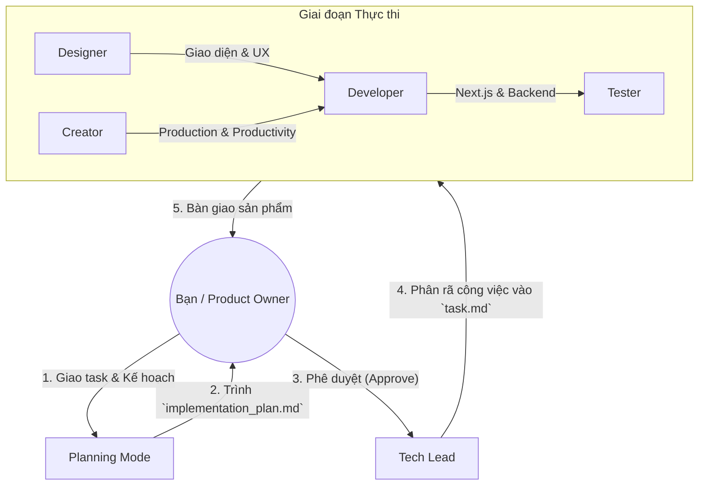

# Hanhan Movie - Antigravity Agent Configuration

## Team Structure & Orchestration
Trong môi trường Antigravity, team được tổ chức để tối ưu hóa việc phát triển sản phẩm Next.js hiện đại, kết hợp giữa thẩm mỹ và hiệu năng:

- **Bạn (User)**: Đóng vai trò là Owner/Product Manager, định hướng và phê duyệt.
- **Tech Lead**: Điều phối, lập kế hoạch kỹ thuật và đảm bảo tính nhất quán của project.
- **Designer (MỚI)**: Chuyên gia UI/UX. Chịu trách nhiệm thiết kế giao diện hiện đại, sang trọng, trải nghiệm người dùng mượt mà và xây dựng Design System.
- **Creator (MỚI)**: Tập trung vào việc tạo ra các sản phẩm/tính năng hướng tới năng suất (productivity) và quy trình sản xuất (production-ready).
- **Fullstack Developer**: Chuyên gia Next.js. Làm việc với cả Frontend (React, Vanilla CSS) và Backend (Next.js API Routes/Server Actions) bằng ngôn ngữ JavaScript hiện đại.
- **Tester**: Đảm bảo chất lượng sản phẩm và rà soát lỗi.

## Tech Stack & Conventions

| Category | Specification |
|------------|------|
| **Frontend** | Next.js (App Router), React |
| **Backend** | Next.js API Routes / Server Actions (Universal JavaScript) |
| **Styling** | Vanilla CSS (Modern CSS, CSS Modules, Variables) |
| **Language** | Modern JavaScript (ES6+, Async/Await) |
| **Design Principles** | Premium Aesthetics, Micro-animations, Responsive Design |
| **Coding Style** | Clean Code, Functional Programming patterns |

## Workflows
- **Planning**: Luôn bắt đầu bằng `implementation_plan.md`.
- **Execution**: Theo dõi qua `task.md`.
- **Handoff**: Tổng kết qua `walkthrough.md`.

## Skills Directory
- `.antigravity/skills/designer/`: UX research, UI Mockups, CSS System.
- `.antigravity/skills/creator/`: Productivity tools, Content automation, Production optimization.
- `.antigravity/skills/developer/`: Next.js implementation, API logic, Database integration.
